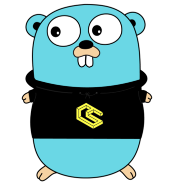

  

 ## Golang Polkadot Runtime Environment Implementation  

[](https://godoc.org/github.com/ChainSafe/gossamer)
[](https://goreportcard.com/report/github.com/ChainSafe/gossamer)
[")](https://travis-ci.com/ChainSafe/gossamer)
[](https://codeclimate.com/github/ChainSafe/gossamer/badges)
[](https://codeclimate.com/github/ChainSafe/gossamer/test_coverage)
[](https://www.gnu.org/licenses/gpl-3.0)
[](https://github.com/RichardLitt/standard-readme)
[](https://twitter.com/chainsafeth)

gossamer is an implementation of the [Polkadot Runtime Environment](https://github.com/w3f/polkadot-re-spec/blob/master/polkadot_re_spec.pdf) written in Go. The Polkadot Runtime Environment is a modular, customizable framework for building blockchains. It has a swappable WASM runtime (ie. state transition function) that can be replaced even after the blockchain has launched without hard forks. It also has a generic extrinsic and block format which are specified in the runtime. The runtime can be written in any language that compiles to WASM. 

Our packages:

| package | description |
|-|-|
| `cmd` | command-line interface for gossamer |
| `codec` | SCALE codec; used for encoding and decoding |
| `common` | commonly used types and functions |
| `config` | client configuration |
| `dot` | wraps other packages to allow a complete client |
| `internal` | internal RPC functions |
| `p2p` | peer-to-peer service using libp2p |
| `polkadb` | database implemenation using badgerDB |
| `rpc` | RPC server |
| `runtime` | WASM runtime integration using the life interpreter |
| `trie` | implementation of a modified Merkle-Patricia trie |

## Dependencies
go 1.12

## Install

```
go get -u github.com/ChainSafe/gossamer
```

## Usage 

```
make gossamer
gossamer --config config.toml
```

### Docker

To start Gossamer in a docker container, run:

```
make docker
```

#### Running Manually

To build the image, run this command:

```
docker build -t chainsafe/gossamer -f Dockerfile.dev
```

Start an instance with:

```
docker run chainsafe/gossamer
```

## Test
```
go test -v ./...
```

## Contributing
- Check out our contribution guidelines: [CONTRIBUTING.md](CONTRIBUTING.md)  
- Have questions? Say hi on [Gitter](https://gitter.im/chainsafe/gossamer)!

## Donations
Our work on gossamer is funded by grants. If you'd like to donate, you can send us ETH or DAI at the following address:
`0x764001D60E69f0C3D0b41B0588866cFaE796972c`

## License
_GNU General Public License v3.0_

<p align="center">
	
</p>
