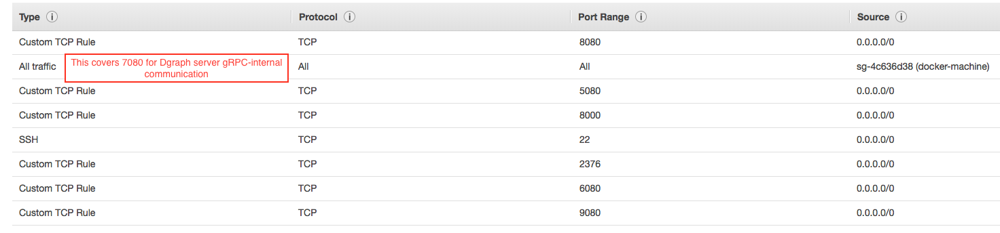

+++
date = "2017-03-20T22:25:17+11:00"
title = "Deploy"
+++

This page talks about running Dgraph in various deployment modes, in a distributed fashion and involves
running multiple instances of Dgraph, over multiple servers in a cluster.

{}
For a single server setup, recommended for new users, please see [Get Started](/get-started) page.
{}

## Install Dgraph
#### Docker

```sh
docker pull dgraph/dgraph:latest

# You can test that it worked fine, by running:
docker run -it dgraph/dgraph:latest dgraph
```

#### Automatic download

Running
```sh
curl https://get.dgraph.io -sSf | bash

# Test that it worked fine, by running:
dgraph
```
would install the `dgraph` binary into your system.

#### Manual download [optional]

If you don't want to follow the automatic installation method, you could manually download the appropriate tar for your platform from **[Dgraph releases](https://github.com/dgraph-io/dgraph/releases)**. After downloading the tar for your platform from Github, extract the binary to `/usr/local/bin` like so.

```sh
# For Linux
$ sudo tar -C /usr/local/bin -xzf dgraph-linux-amd64-VERSION.tar.gz

# For Mac
$ sudo tar -C /usr/local/bin -xzf dgraph-darwin-amd64-VERSION.tar.gz

# Test that it worked fine, by running:
dgraph
```

#### Building from Source

{}
Ratel UI is closed source right now, so you cannot build it from source. But you can connect to your Dgraph instance
through Ratel UI installed using any of the methods listed above.
{}

Make sure you have [Go](https://golang.org/dl/) (version >= 1.8) installed.

After installing Go, run
```sh
# This should install dgraph binary in your $GOPATH/bin.

go get -v github.com/dgraph-io/dgraph/dgraph
```

If you get errors related to `grpc` while building them, your
`go-grpc` version might be outdated. We don't vendor in `go-grpc`(because it
causes issues while using the Go client). Update your `go-grpc` by running.
```sh
go get -u -v google.golang.org/grpc
```

#### Config

The full set of dgraph's configuration options (along with brief descriptions)
can be viewed by invoking dgraph with the `--help` flag. For example, to see
the options available for `dgraph alpha`, run `dgraph alpha --help`.

The options can be configured in multiple ways (from highest precedence to
lowest precedence):

- Using command line flags (as described in the help output).

- Using environment variables.

- Using a configuration file.

If no configuration for an option is used, then the default value as described
in the `--help` output applies.

Multiple configuration methods can be used all at the same time. E.g. a core
set of options could be set in a config file, and instance specific options
could be set using environment vars or flags.

The environment variable names mirror the flag names as seen in the `--help`
output. They are the concatenation of `DGRAPH`, the subcommand invoked
(`ALPHA`, `ZERO`, `LIVE`, or `BULK`), and then the name of the flag (in
uppercase). For example, instead of using `dgraph alpha --lru_mb=8096`, you
could use `DGRAPH_ALPHA_LRU_MB=8096 dgraph alpha`.

Configuration file formats supported are JSON, TOML, YAML, HCL, and Java
properties (detected via file extension). The file extensions are .json, .toml,
.yml or .yaml, .hcl, and .properties for each format.

A configuration file can be specified using the `--config` flag, or an
environment variable. E.g. `dgraph zero --config my_config.json` or
`DGRAPH_ZERO_CONFIG=my_config.json dgraph zero`.

The config file structure is just simple key/value pairs (mirroring the flag
names).

Example JSON config file (config.json):

```json
{
  "my": "localhost:7080",
  "zero": "localhost:5080",
  "lru_mb": 4096,
  "postings": "/path/to/p",
  "wal": "/path/to/w"
}
```

Example TOML config file (config.toml):

```toml
my = "localhost:7080"
zero = "localhost:5080"
lru_mb = 4096
postings = "/path/to/p"
wal = "/path/to/w"
```


Example YAML config file (config.yml):

```yaml
my: "localhost:7080"
zero: "localhost:5080"
lru_mb: 4096
postings: "/path/to/p"
wal: "/path/to/w"
```

Example HCL config file (config.hcl):

```hcl
my = "localhost:7080"
zero = "localhost:5080"
lru_mb = 4096
postings = "/path/to/p"
wal = "/path/to/w"
```

Example Java properties config file (config.properties):
```text
my=localhost:7080
zero=localhost:5080
lru_mb=4096
postings=/path/to/p
wal=/path/to/w
```

## Cluster Setup

### Understanding Dgraph cluster

Dgraph is a truly distributed graph database - not a master-slave replication of
universal dataset. It shards by predicate and replicates predicates across the
cluster, queries can be run on any node and joins are handled over the
distributed data.  A query is resolved locally for predicates the node stores,
and via distributed joins for predicates stored on other nodes.

For effectively running a Dgraph cluster, it's important to understand how
sharding, replication and rebalancing works.

**Sharding**

Dgraph colocates data per predicate (* P *, in RDF terminology), thus the
smallest unit of data is one predicate. To shard the graph, one or many
predicates are assigned to a group. Each Alpha node in the cluster serves a
single group. Dgraph Zero assigns a group to each Alpha node.

**Shard rebalancing**

Dgraph Zero tries to rebalance the cluster based on the disk usage in each
group. If Zero detects an imbalance, it would try to move a predicate along with
its indices to a group that has minimum disk usage. This can make the predicate
temporarily read-only. Queries for the predicate will still be serviced, but any
mutations for the predicate will be rejected and should be retried after the
move is finished.

Zero would continuously try to keep the amount of data on each server even,
typically running this check on a 10-min frequency.  Thus, each additional
Dgraph Alpha instance would allow Zero to further split the predicates from
groups and move them to the new node.

**Consistent Replication**

If `--replicas` flag is set to something greater than one, Zero would assign the
same group to multiple nodes. These nodes would then form a Raft group aka
quorum. Every write would be consistently replicated to the quorum. To achieve
consensus, its important that the size of quorum be an odd number. Therefore, we
recommend setting `--replicas` to 1, 3 or 5 (not 2 or 4). This allows 0, 1, or 2
nodes serving the same group to be down, respectively without affecting the
overall health of that group.

## Ports Usage

Dgraph cluster nodes use different ports to communicate over gRPC and HTTP. User has to pay attention while choosing these ports based on their topology and deployment-mode as each port needs different access security rules or firewall.

### Types of ports

- **gRPC-internal:** Port that is used between the cluster nodes for internal communication and message exchange.
- **gRPC-external:** Port that is used by Dgraph clients, Dgraph Live Loader , and Dgraph Bulk loader to access APIs over gRPC.
- **http-external:** Port that is used by clients to access APIs over HTTP and other monitoring & administrative tasks.

### Ports used by different nodes

 Dgraph Node Type | gRPC-internal  | gRPC-external | HTTP-external
------------------|----------------|---------------|---------------
       zero       |  --Not Used--  |     5080      |     6080
       alpha      |      7080      |     9080      |     8080
       ratel      |  --Not Used--  | --Not Used--  |     8000

Users have to modify security rules or open firewall depending up on their underlying network to allow communication between cluster nodes and between a server and a client. During development a general rule could be wide open *-external (gRPC/HTTP) ports to public and gRPC-internal to be open within the cluster nodes.

**Ratel UI** accesses Dgraph Alpha on the HTTP-external port (default localhost:8080) and can be configured to talk to remote Dgraph cluster. This way you can run Ratel on your local machine and point to a remote cluster. But if you are deploying Ratel along with Dgraph cluster, then you may have to expose 8000 to the public.

**Port Offset** To make it easier for user to setup the cluster, Dgraph defaults the ports used by Dgraph nodes and let user to provide an offset  (through command option `--port_offset`) to define actual ports used by the node. Offset can also be used when starting multiple zero nodes in a HA setup.

For example, when a user runs a Dgraph Alpha by setting `--port_offset 2`, then the Alpha node binds to 7082 (gRPC-internal), 8082 (HTTP-external) & 9092 (gRPC-external) respectively.

**Ratel UI** by default listens on port 8000. You can use the `-port` flag to configure to listen on any other port.

{}
**For Dgraph v1.0.2 (or older)**

Zero's default ports are 7080 and 8080. When following instructions for the different setup guides below, override the Zero ports using `--port_offset` to match the current default ports.

```sh
# Run Zero with ports 5080 and 6080
dgraph zero --idx=1 --port_offset -2000
# Run Zero with ports 5081 and 6081
dgraph zero --idx=2 --port_offset -1999
```
Likewise, Ratel's default port is 8081, so override it using `--port` to the current default port.

```sh
dgraph-ratel --port 8080
```
{}

### HA Cluster Setup

In a high-availability setup, we need to run 3 or 5 replicas for Zero, and similarly, 3 or 5 replicas for Alpha.
{}
If number of replicas is 2K + 1, up to **K servers** can be down without any impact on reads or writes.

Avoid keeping replicas to 2K (even number). If K servers go down, this would block reads and writes, due to lack of consensus.
{}

**Dgraph Zero**
Run three Zero instances, assigning a unique ID(Integer) to each via `--idx` flag, and
passing the address of any healthy Zero instance via `--peer` flag.

To run three replicas for the alphas, set `--replicas=3`. Every time a new
Dgraph Alpha is added, Zero would check the existing groups and assign them to
one, which doesn't have three replicas.

**Dgraph Alpha**
Run as many Dgraph Alphas as you want. You can manually set `--idx` flag, or you
can leave that flag empty, and Zero would auto-assign an id to the Alpha. This
id would get persisted in the write-ahead log, so be careful not to delete it.

The new Alphas will automatically detect each other by communicating with
Dgraph zero and establish connections to each other.

Typically, Zero would first attempt to replicate a group, by assigning a new
Dgraph alpha to run the same group as assigned to another. Once the group has
been replicated as per the `--replicas` flag, Zero would create a new group.

Over time, the data would be evenly split across all the groups. So, it's
important to ensure that the number of Dgraph alphas is a multiple of the
replication setting. For e.g., if you set `--replicas=3` in Zero, then run three
Dgraph alphas for no sharding, but 3x replication. Run six Dgraph alphas, for
sharding the data into two groups, with 3x replication.

## Single Host Setup

### Run directly on the host

**Run dgraph zero**

```sh
dgraph zero --my=IPADDR:5080
```
The `--my` flag is the connection that Dgraph alphas would dial to talk to
zero. So, the port `5080` and the IP address must be visible to all the Dgraph alphas.

For all other various flags, run `dgraph zero --help`.

**Run dgraph alpha**

```sh
dgraph alpha --lru_mb=<typically one-third the RAM> --my=IPADDR:7080 --zero=localhost:5080
dgraph alpha --lru_mb=<typically one-third the RAM> --my=IPADDR:7081 --zero=localhost:5080 -o=1
```

Notice the use of `-o` for the second Alpha to add offset to the default ports used. Zero automatically assigns an unique ID to each Alpha, which is persisted in the write ahead log (wal) directory, users can specify the index using `--idx` option. Dgraph Alphas use two directories to persist data and
wal logs, and these directories must be different for each Alpha if they are running on the same host. You can use `-p` and `-w` to change the location of the data and WAL directories. For all other flags, run

`dgraph alpha --help`.

**Run dgraph UI**

```sh
dgraph-ratel
```

### Run using Docker

Dgraph cluster can be setup running as containers on a single host. First, you'd want to figure out the host IP address. You can typically do that via

```sh
ip addr  # On Arch Linux
ifconfig # On Ubuntu/Mac
```
We'll refer to the host IP address via `HOSTIPADDR`.

**Run dgraph zero**

```sh
mkdir ~/zero # Or any other directory where data should be stored.

docker run -it -p 5080:5080 -p 6080:6080 -v ~/zero:/dgraph dgraph/dgraph:latest dgraph zero --my=HOSTIPADDR:5080
```

**Run dgraph alpha**
```sh
mkdir ~/server1 # Or any other directory where data should be stored.

docker run -it -p 7080:7080 -p 8080:8080 -p 9080:9080 -v ~/server1:/dgraph dgraph/dgraph:latest dgraph alpha --lru_mb=<typically one-third the RAM> --zero=HOSTIPADDR:5080 --my=HOSTIPADDR:7080

mkdir ~/server2 # Or any other directory where data should be stored.

docker run -it -p 7081:7081 -p 8081:8081 -p 9081:9081 -v ~/server2:/dgraph dgraph/dgraph:latest dgraph alpha --lru_mb=<typically one-third the RAM> --zero=HOSTIPADDR:5080 --my=HOSTIPADDR:7081  -o=1
```
Notice the use of -o for server2 to override the default ports for server2.

**Run dgraph UI**
```sh
docker run -it -p 8000:8000 dgraph/dgraph:latest dgraph-ratel
```

### Run using Docker Compose (On single AWS instance)

We will use [Docker Machine](https://docs.docker.com/machine/overview/). It is a tool that lets you install Docker Engine on virtual machines and easily deploy applications.

* [Install Docker Machine](https://docs.docker.com/machine/install-machine/) on your machine.

{}These instructions are for running Dgraph Alpha without TLS config.
Instructions for running with TLS refer [TLS instructions](#tls-configuration).{}

Here we'll go through an example of deploying Dgraph Zero, Alpha and Ratel on an AWS instance.

* Make sure you have Docker Machine installed by following [instructions](https://docs.docker.com/machine/install-machine/), provisioning an instance on AWS is just one step away. You'll have to [configure your AWS credentials](http://docs.aws.amazon.com/sdk-for-java/v1/developer-guide/setup-credentials.html) for programmatic access to the Amazon API.

* Create a new docker machine.

```sh
docker-machine create --driver amazonec2 aws01
```

Your output should look like

```sh
Running pre-create checks...
Creating machine...
(aws01) Launching instance...
...
...
Docker is up and running!
To see how to connect your Docker Client to the Docker Engine running on this virtual machine, run: docker-machine env aws01
```

The command would provision a `t2-micro` instance with a security group called `docker-machine`
(allowing inbound access on 2376 and 22). You can either edit the security group to allow inbound access to '5080`, `8080`, `9080` (default ports for Dgraph Zero & Alpha) or you can provide your own security
group which allows inbound access on port 22, 2376 (required by Docker Machine), 5080, 8080 and 9080. Remember port *5080* is only required if you are running Dgraph Live Loader or Dgraph Bulk Loader from outside.

[Here](https://docs.docker.com/machine/drivers/aws/#options) is a list of full options for the `amazonec2` driver which allows you choose the instance type, security group, AMI among many other things.

{}Docker machine supports [other drivers](https://docs.docker.com/machine/drivers/gce/) like GCE, Azure etc.{}

* Install and run Dgraph using docker-compose

Docker Compose is a tool for running multi-container Docker applications. You can follow the
instructions [here](https://docs.docker.com/compose/install/) to install it.

Copy the file below in a directory on your machine and name it `docker-compose.yml`.

```sh
version: "3.2"
services:
  zero:
    image: dgraph/dgraph:latest
    volumes:
      - /data:/dgraph
    ports:
      - 5080:5080
      - 6080:6080
    restart: on-failure
    command: dgraph zero --my=zero:5080
  server:
    image: dgraph/dgraph:latest
    volumes:
      - /data:/dgraph
    ports:
      - 8080:8080
      - 9080:9080
    restart: on-failure
    command: dgraph alpha --my=server:7080 --lru_mb=2048 --zero=zero:5080
  ratel:
    image: dgraph/dgraph:latest
    ports:
      - 8000:8000
    command: dgraph-ratel
```

{}The config mounts `/data`(you could mount something else) on the instance to `/dgraph` within the
container for persistence.{}

* Connect to the Docker Engine running on the machine.

Running `docker-machine env aws01` tells us to run the command below to configure
our shell.
```
eval $(docker-machine env aws01)
```
This configures our Docker client to talk to the Docker engine running on the AWS Machine.

Finally run the command below to start the Zero and Alpha.
```
docker-compose up -d
```
This would start 3 Docker containers running Dgraph Zero, Alpha and Ratel on the same machine. Docker would restart the containers in case there is any error.
You can look at the logs using `docker-compose logs`.

## Multi Host Setup

### Using Docker Swarm

#### Cluster Setup Using Docker Swarm

{}These instructions are for running Dgraph Alpha without TLS config.
Instructions for running with TLS refer [TLS instructions](#tls-configuration).{}

Here we'll go through an example of deploying 3 Dgraph Alpha nodes and 1 Zero on three different AWS instances using Docker Swarm with a replication factor of 3.

* Make sure you have Docker Machine installed by following [instructions](https://docs.docker.com/machine/install-machine/).

```sh
docker-machine --version
```

* Create 3 instances on AWS and [install Docker Engine](https://docs.docker.com/engine/installation/) on them. This can be done manually or by using `docker-machine`.
You'll have to [configure your AWS credentials](http://docs.aws.amazon.com/sdk-for-java/v1/developer-guide/setup-credentials.html) to create the instances using Docker Machine.

Considering that you have AWS credentials setup, you can use the below commands to start 3 AWS
`t2-micro` instances with Docker Engine installed on them.

```sh
docker-machine create --driver amazonec2 aws01
docker-machine create --driver amazonec2 aws02
docker-machine create --driver amazonec2 aws03
```

Your output should look like

```sh
Running pre-create checks...
Creating machine...
(aws01) Launching instance...
...
...
Docker is up and running!
To see how to connect your Docker Client to the Docker Engine running on this virtual machine, run: docker-machine env aws01
```

The command would provision a `t2-micro` instance with a security group called `docker-machine`
(allowing inbound access on 2376 and 22).

You would need to edit the `docker-machine` security group to open inbound traffic on the following ports.

1. Allow all inbound traffic on all ports with Source being `docker-machine`
   security ports so that Docker related communication can happen easily.

2. Also open inbound TCP traffic on the following ports required by Dgraph:
   `5080`, `6080`, `8000`, `808[0-2]`, `908[0-2]`. Remember port *5080* is only
   required if you are running Dgraph Live Loader or Dgraph Bulk Loader from
   outside. You need to open `7080` to enable Alpha-to-Alpha communication in
   case you have not opened all ports in #1.

If you are on AWS, below is the security group (**docker-machine**) after
necessary changes.



[Here](https://docs.docker.com/machine/drivers/aws/#options) is a list of full options for the `amazonec2` driver which allows you choose the
instance type, security group, AMI among many other
things.

{}Docker machine supports [other drivers](https://docs.docker.com/machine/drivers/gce/) like GCE, Azure etc.{}

Running `docker-machine ps` shows all the AWS EC2 instances that we started.
```sh
➜  ~ docker-machine ls
NAME    ACTIVE   DRIVER       STATE     URL                         SWARM   DOCKER        ERRORS
aws01   -        amazonec2    Running   tcp://34.200.239.30:2376            v17.11.0-ce
aws02   -        amazonec2    Running   tcp://54.236.58.120:2376            v17.11.0-ce
aws03   -        amazonec2    Running   tcp://34.201.22.2:2376              v17.11.0-ce
```

* Start the Swarm

Docker Swarm has manager and worker nodes. Swarm can be started and updated on manager nodes. We
   will setup `aws01` as swarm manager. You can first run the following commands to initialize the
   swarm.

We are going to use the internal IP address given by AWS. Run the following command to get the
internal IP for `aws01`. Lets assume `172.31.64.18` is the internal IP in this case.
```
docker-machine ssh aws01 ifconfig eth0
```

Now that we have the internal IP, let's initiate the Swarm.

```sh
# This configures our Docker client to talk to the Docker engine running on the aws01 host.
eval $(docker-machine env aws01)
docker swarm init --advertise-addr 172.31.64.18
```

Output:
```
Swarm initialized: current node (w9mpjhuju7nyewmg8043ypctf) is now a manager.

To add a worker to this swarm, run the following command:

    docker swarm join \
    --token SWMTKN-1-1y7lba98i5jv9oscf10sscbvkmttccdqtkxg478g3qahy8dqvg-5r5cbsntc1aamsw3s4h3thvgk \
    172.31.64.18:2377

To add a manager to this swarm, run 'docker swarm join-token manager' and follow the instructions.
```

Now we will make other nodes join the swarm.

```sh
eval $(docker-machine env aws02)
docker swarm join \
    --token SWMTKN-1-1y7lba98i5jv9oscf10sscbvkmttccdqtkxg478g3qahy8dqvg-5r5cbsntc1aamsw3s4h3thvgk \
    172.31.64.18:2377
```

Output:
```
This node joined a swarm as a worker.
```

Similarly, aws03
```sh
eval $(docker-machine env aws03)
docker swarm join \
    --token SWMTKN-1-1y7lba98i5jv9oscf10sscbvkmttccdqtkxg478g3qahy8dqvg-5r5cbsntc1aamsw3s4h3thvgk \
    172.31.64.18:2377
```

On the Swarm manager `aws01`, verify that your swarm is running.
```sh
docker node ls
```

Output:
```sh
ID                            HOSTNAME            STATUS              AVAILABILITY        MANAGER STATUS
ghzapjsto20c6d6l3n0m91zev     aws02               Ready               Active
rb39d5lgv66it1yi4rto0gn6a     aws03               Ready               Active
waqdyimp8llvca9i09k4202x5 *   aws01               Ready               Active              Leader
```

* Start the Dgraph cluster

Copy the following file on your host machine and name it as `docker-compose.yml`

```sh
version: "3"
networks:
  dgraph:
services:
  zero:
    image: dgraph/dgraph:latest
    volumes:
      - data-volume:/dgraph
    ports:
      - 5080:5080
      - 6080:6080
    networks:
      - dgraph
    deploy:
      placement:
        constraints:
          - node.hostname == aws01
    command: dgraph zero --my=zero:5080 --replicas 3
  alpha_1:
    image: dgraph/dgraph:latest
    hostname: "alpha_1"
    volumes:
      - data-volume:/dgraph
    ports:
      - 8080:8080
      - 9080:9080
    networks:
      - dgraph
    deploy:
      placement:
        constraints:
          - node.hostname == aws01
    command: dgraph alpha --my=alpha_1:7080 --lru_mb=2048 --zero=zero:5080
  alpha_2:
    image: dgraph/dgraph:latest
    hostname: "alpha_2"
    volumes:
      - data-volume:/dgraph
    ports:
      - 8081:8081
      - 9081:9081
    networks:
      - dgraph
    deploy:
      placement:
        constraints:
          - node.hostname == aws02
    command: dgraph alpha --my=alpha_2:7081 --lru_mb=2048 --zero=zero:5080 -o 1
  alpha_3:
    image: dgraph/dgraph:latest
    hostname: "alpha_3"
    volumes:
      - data-volume:/dgraph
    ports:
      - 8082:8082
      - 9082:9082
    networks:
      - dgraph
    deploy:
      placement:
        constraints:
          - node.hostname == aws03
    command: dgraph alpha --my=alpha_3:7082 --lru_mb=2048 --zero=zero:5080 -o 2
  ratel:
    image: dgraph/dgraph:latest
    hostname: "ratel"
    ports:
      - 8000:8000
    networks:
      - dgraph
    command: dgraph-ratel
volumes:
  data-volume:
```
Run the following command on the Swarm leader to deploy the Dgraph Cluster.

```sh
eval $(docker-machine env aws01)
docker stack deploy -c docker-compose.yml dgraph
```

This should run three Dgraph Alpha services (one on each VM because of the
constraint we have), one Dgraph Zero service on aws01 and one Dgraph Ratel.

These placement constraints (as seen in the compose file) are important so that
in case of restarting any containers, swarm places the respective Dgraph Alpha
or Zero containers on the same hosts to re-use the volumes. Also, if you are
running fewer than three hosts, make sure you use either different volumes or
run Dgraph Alpha with `-p p1 -w w1` options.

{}

1. This setup would create and use a local volume called `dgraph_data-volume` on
   the instances. If you plan to replace instances, you should use remote
   storage like
   [cloudstore](https://docs.docker.com/docker-for-aws/persistent-data-volumes)
   instead of local disk. {}

You can verify that all services were created successfully by running:

```sh
docker service ls
```

Output:
```
ID                  NAME                MODE                REPLICAS            IMAGE                PORTS
vp5bpwzwawoe        dgraph_ratel        replicated          1/1                 dgraph/dgraph:latest   *:8000->8000/tcp
69oge03y0koz        dgraph_alpha_2      replicated          1/1                 dgraph/dgraph:latest   *:8081->8081/tcp,*:9081->9081/tcp
kq5yks92mnk6        dgraph_alpha_3      replicated          1/1                 dgraph/dgraph:latest   *:8082->8082/tcp,*:9082->9082/tcp
uild5cqp44dz        dgraph_zero         replicated          1/1                 dgraph/dgraph:latest   *:5080->5080/tcp,*:6080->6080/tcp
v9jlw00iz2gg        dgraph_alpha_1      replicated          1/1                 dgraph/dgraph:latest   *:8080->8080/tcp,*:9080->9080/tcp
```

To stop the cluster run

```
docker stack rm dgraph
```

### HA Cluster setup using Docker Swarm

Here is a sample swarm config for running 6 Dgraph Alpha nodes and 3 Zero nodes on 6 different
ec2 instances. Setup should be similar to [Cluster setup using Docker Swarm]() apart from a couple of differences. This setup would ensure replication with sharding of data. The file assumes that there are six hosts available as docker-machines. Also if you are running on fewer than six hosts, make sure you use either different volumes or run Dgraph Alpha with `-p p1 -w w1` options.

You would need to edit the `docker-machine` security group to open inbound traffic on the following ports.

1. Allow all inbound traffic on all ports with Source being `docker-machine` security ports so that
   docker related communication can happen easily.

2. Also open inbound TCP traffic on the following ports required by Dgraph: `5080`, `8000`, `808[0-5]`, `908[0-5]`. Remember port *5080* is only required if you are running Dgraph Live Loader or Dgraph Bulk Loader from outside. You need to open `7080` to enable Alpha-to-Alpha communication in case you have not opened all ports in #1.

If you are on AWS, below is the security group (**docker-machine**) after necessary changes.


Copy the following file on your host machine and name it as docker-compose.yml

```sh
version: "3"
networks:
  dgraph:
services:
  zero_1:
    image: dgraph/dgraph:latest
    volumes:
      - data-volume:/dgraph
    ports:
      - 5080:5080
      - 6080:6080
    networks:
      - dgraph
    deploy:
      placement:
        constraints:
          - node.hostname == aws01
    command: dgraph zero --my=zero_1:5080 --replicas 3 --idx 1
  zero_2:
    image: dgraph/dgraph:latest
    volumes:
      - data-volume:/dgraph
    ports:
      - 5081:5081
      - 6081:6081
    networks:
      - dgraph
    deploy:
      placement:
        constraints:
          - node.hostname == aws02
    command: dgraph zero -o 1 --my=zero_2:5081 --replicas 3 --peer zero_1:5080 --idx 2
  zero_3:
    image: dgraph/dgraph:latest
    volumes:
      - data-volume:/dgraph
    ports:
      - 5082:5082
      - 6082:6082
    networks:
      - dgraph
    deploy:
      placement:
        constraints:
          - node.hostname == aws03
    command: dgraph zero -o 2 --my=zero_3:5082 --replicas 3 --peer zero_1:5080 --idx 3
  alpha_1:
    image: dgraph/dgraph:latest
    hostname: "alpha_1"
    volumes:
      - data-volume:/dgraph
    ports:
      - 8080:8080
      - 9080:9080
    networks:
      - dgraph
    deploy:
      replicas: 1
      placement:
        constraints:
          - node.hostname == aws01
    command: dgraph alpha --my=alpha_1:7080 --lru_mb=2048 --zero=zero_1:5080
  alpha_2:
    image: dgraph/dgraph:latest
    hostname: "alpha_2"
    volumes:
      - data-volume:/dgraph
    ports:
      - 8081:8081
      - 9081:9081
    networks:
      - dgraph
    deploy:
      replicas: 1
      placement:
        constraints:
          - node.hostname == aws02
    command: dgraph alpha --my=alpha_2:7081 --lru_mb=2048 --zero=zero_1:5080 -o 1
  alpha_3:
    image: dgraph/dgraph:latest
    hostname: "alpha_3"
    volumes:
      - data-volume:/dgraph
    ports:
      - 8082:8082
      - 9082:9082
    networks:
      - dgraph
    deploy:
      replicas: 1
      placement:
        constraints:
          - node.hostname == aws03
    command: dgraph alpha --my=alpha_3:7082 --lru_mb=2048 --zero=zero_1:5080 -o 2
  alpha_4:
    image: dgraph/dgraph:latest
    hostname: "alpha_4"
    volumes:
      - data-volume:/dgraph
    ports:
      - 8083:8083
      - 9083:9083
    networks:
      - dgraph
    deploy:
      placement:
        constraints:
          - node.hostname == aws04
    command: dgraph alpha --my=alpha_4:7083 --lru_mb=2048 --zero=zero_1:5080 -o 3
  alpha_5:
    image: dgraph/dgraph:latest
    hostname: "alpha_5"
    volumes:
      - data-volume:/dgraph
    ports:
      - 8084:8084
      - 9084:9084
    networks:
      - dgraph
    deploy:
      placement:
        constraints:
          - node.hostname == aws05
    command: dgraph alpha --my=alpha_5:7084 --lru_mb=2048 --zero=zero_1:5080 -o 4
  alpha_6:
    image: dgraph/dgraph:latest
    hostname: "alpha_6"
    volumes:
      - data-volume:/dgraph
    ports:
      - 8085:8085
      - 9085:9085
    networks:
      - dgraph
    deploy:
      placement:
        constraints:
          - node.hostname == aws06
    command: dgraph alpha --my=alpha_6:7085 --lru_mb=2048 --zero=zero_1:5080 -o 5
  ratel:
    image: dgraph/dgraph:latest
    hostname: "ratel"
    ports:
      - 8000:8000
    networks:
      - dgraph
    command: dgraph-ratel
volumes:
  data-volume:
```
{}
1. This setup assumes that you are using 6 hosts, but if you are running fewer than 6 hosts then you have to either use different volumes between Dgraph alphas or use `-p` & `-w` to configure data directories.
2. This setup would create and use a local volume called `dgraph_data-volume` on the instances. If you plan to replace instances, you should use remote storage like [cloudstore](https://docs.docker.com/docker-for-aws/persistent-data-volumes) instead of local disk. {}

## Using Kubernetes (v1.8.4)

{}These instructions are for running Dgraph Alpha without TLS config.
Instructions for running with TLS refer [TLS instructions](#tls-configuration).{}

* Install [kubectl](https://kubernetes.io/docs/tasks/tools/install-kubectl/) which is used to deploy
  and manage applications on kubernetes.
* Get the kubernetes cluster up and running on a cloud provider of your choice. You can use [kops](https://github.com/kubernetes/kops/blob/master/docs/aws.md) to set it up on AWS. Kops does auto-scaling by default on AWS and creates the volumes and instances for you.

Verify that you have your cluster up and running using `kubectl get nodes`. If you used `kops` with
the default options, you should have a master and two worker nodes ready.

```sh
➜  kubernetes git:(master) ✗ kubectl get nodes
NAME                                          STATUS    ROLES     AGE       VERSION
ip-172-20-42-118.us-west-2.compute.internal   Ready     node      1h        v1.8.4
ip-172-20-61-179.us-west-2.compute.internal   Ready     master    2h        v1.8.4
ip-172-20-61-73.us-west-2.compute.internal    Ready     node      2h        v1.8.4
```

### Single Server

Once your Kubernetes cluster is up, you can use [dgraph-single.yaml](https://github.com/dgraph-io/dgraph/blob/master/contrib/config/kubernetes/dgraph-single.yaml) to start a Zero and Alpha.

* From your machine, run the following command to start a StatefulSet that
  creates a Pod with Zero and Alpha running in it.

```sh
kubectl create -f https://raw.githubusercontent.com/dgraph-io/dgraph/master/contrib/config/kubernetes/dgraph-single.yaml
```

Output:
```
service "dgraph-public" created
statefulset "dgraph" created
```

* Confirm that the pod was created successfully.

```sh
kubectl get pods
```

Output:
```
NAME       READY     STATUS    RESTARTS   AGE
dgraph-0   3/3       Running   0          1m
```

{}You can check the logs for the containers in the pod using `kubectl logs -f dgraph-0 <container_name>`. For example, try `kubectl logs -f dgraph-0 alpha` for server logs.{}

* Test the setup

Port forward from your local machine to the pod

```sh
kubectl port-forward dgraph-0 8080
kubectl port-forward dgraph-0 8000
```

Go to `http://localhost:8000` and verify Dgraph is working as expected.

{} You can also access the service on its External IP address.{}


* Stop the cluster

Delete all the resources

```sh
kubectl delete pods,statefulsets,services,persistentvolumeclaims,persistentvolumes -l app=dgraph
```

Stop the cluster. If you used `kops` you can run the following command.

```sh
kops delete cluster ${NAME} --yes
```

### HA Cluster Setup Using Kubernetes

This setup allows you to run 3 Dgraph Alphas and 3 Dgraph Zeros. We start Zero with `--replicas
3` flag, so all data would be replicated on 3 Alphas and form 1 alpha group.

{} Ideally you should have at least three worker nodes as part of your Kubernetes
cluster so that each Dgraph Alpha runs on a separate node.{}

* Check the nodes that are part of the Kubernetes cluster.

```sh
kubectl get nodes
```

Output:
```sh
NAME                                          STATUS    ROLES     AGE       VERSION
ip-172-20-34-90.us-west-2.compute.internal    Ready     master    6m        v1.8.4
ip-172-20-51-1.us-west-2.compute.internal     Ready     node      4m        v1.8.4
ip-172-20-59-116.us-west-2.compute.internal   Ready     node      4m        v1.8.4
ip-172-20-61-88.us-west-2.compute.internal    Ready     node      5m        v1.8.4
```

Once your Kubernetes cluster is up, you can use [dgraph-ha.yaml](https://github.com/dgraph-io/dgraph/blob/master/contrib/config/kubernetes/dgraph-ha.yaml) to start the cluster.

* From your machine, run the following command to start the cluster.

```sh
kubectl create -f https://raw.githubusercontent.com/dgraph-io/dgraph/master/contrib/config/kubernetes/dgraph-ha.yaml
```

Output:
```sh
service "dgraph-zero-public" created
service "dgraph-alpha-public" created
service "dgraph-alpha-0-http-public" created
service "dgraph-ratel-public" created
service "dgraph-zero" created
service "dgraph-alpha" created
statefulset "dgraph-zero" created
statefulset "dgraph-alpha" created
deployment "dgraph-ratel" created
```

* Confirm that the pods were created successfully.

```sh
kubectl get pods
```

Output:
```sh
NAME                   READY     STATUS    RESTARTS   AGE
dgraph-ratel-<pod-id>  1/1       Running   0          9s
dgraph-alpha-0         1/1       Running   0          2m
dgraph-alpha-1         1/1       Running   0          2m
dgraph-alpha-2         1/1       Running   0          2m
dgraph-zero-0          1/1       Running   0          2m
dgraph-zero-1          1/1       Running   0          2m
dgraph-zero-2          1/1       Running   0          2m

```

{}You can check the logs for the containers in the pod using `kubectl logs -f dgraph-alpha-0` and `kubectl logs -f dgraph-zero-0`.{}

* Test the setup

Port forward from your local machine to the pod

```sh
kubectl port-forward dgraph-alpha-0 8080
kubectl port-forward dgraph-ratel-<pod-id> 8000
```

Go to `http://localhost:8000` and verify Dgraph is working as expected.

{} You can also access the service on its External IP address.{}


* Stop the cluster

Delete all the resources

```sh
kubectl delete pods,statefulsets,services,persistentvolumeclaims,persistentvolumes -l app=dgraph-zero
kubectl delete pods,statefulsets,services,persistentvolumeclaims,persistentvolumes -l app=dgraph-alpha
kubectl delete pods,replicasets,services,persistentvolumeclaims,persistentvolumes -l app=dgraph-ratel
```

Stop the cluster. If you used `kops` you can run the following command.

```sh
kops delete cluster ${NAME} --yes
```

### Kubernetes Storage

The Kubernetes configurations in the previous sections were configured to run
Dgraph with any storage type (`storage-class: anything`). On the common cloud
environments like AWS, GCP, and Azure, the default storage type are slow disks
like hard disks or low IOPS SSDs. We highly recommend using faster disks for
ideal performance when running Dgraph.

#### Local storage

The AWS storage-optimized i-class instances provide locally attached NVMe-based
SSD storage which provide consistent very high IOPS. The Dgraph team uses
i3.large instances on AWS to test Dgraph.

You can create a Kubernetes `StorageClass` object to provision a specific type
of storage volume which you can then attach to your Dgraph pods. You can set up
your cluster with local SSDs by using [Local Persistent
Volumes](https://kubernetes.io/blog/2018/04/13/local-persistent-volumes-beta/).
This Kubernetes feature is in beta at the time of this writing (Kubernetes
v1.13.1). You can first set up an EC2 instance with locally attached storage.
Once it is formatted and mounted properly, then you can create a StorageClass to
access it.:

```yaml
apiVersion: storage.k8s.io/v1
kind: StorageClass
metadata:
  name: <your-local-storage-class-name>
provisioner: kubernetes.io/no-provisioner
volumeBindingMode: WaitForFirstConsumer
```

Currently, Kubernetes does not allow automatic provisioning of local storage. So
a PersistentVolume with a specific mount path should be created:

```yaml
apiVersion: v1
kind: PersistentVolume
metadata:
  name: <your-local-pv-name>
spec:
  capacity:
    storage: 475Gi
  volumeMode: Filesystem
  accessModes:
  - ReadWriteOnce
  persistentVolumeReclaimPolicy: Delete
  storageClassName: <your-local-storage-class-name>
  local:
    path: /data
  nodeAffinity:
    required:
      nodeSelectorTerms:
      - matchExpressions:
        - key: kubernetes.io/hostname
          operator: In
          values:
          - <node-name>
```

Then, in the StatefulSet configuration you can claim this local storage in
.spec.volumeClaimTemplate:

```
kind: StatefulSet
...
 volumeClaimTemplates:
  - metadata:
      name: datadir
    spec:
      accessModes:
      - ReadWriteOnce
      storageClassName: <your-local-storage-class-name>
      resources:
        requests:
          storage: 500Gi
```

You can repeat these steps for each instance that's configured with local
node storage.

#### Non-local persistent disks

EBS volumes on AWS and PDs on GCP are persistent disks that can be configured
with Dgraph. The disk performance is much lower than locally attached storage
but can be sufficient for your workload such as testing environments.

When using EBS volumes on AWS, we recommend using Provisioned IOPS SSD EBS
volumes (the io1 disk type) which provide consistent IOPS. The available IOPS
for AWS EBS volumes is based on the total disk size. With Kubernetes, you can
request io1 disks to be provisioned with this config with 50 IOPS/GB using the
`iopsPerGB` parameter:

```
kind: StorageClass
apiVersion: storage.k8s.io/v1
metadata:
  name: <your-storage-class-name>
provisioner: kubernetes.io/aws-ebs
parameters:
  type: io1
  iopsPerGB: "50"
  fsType: ext4
```

Example: Requesting a disk size of 250Gi with this storage class would provide
12.5K IOPS.

### Removing a Dgraph Pod

In the event that you need to completely remove a pod (e.g., its disk got
corrupted and data cannot be recovered), you can use the `/removeNode` API to
remove the node from the cluster. With a Kubernetes StatefulSet, you'll need to
remove the node in this order:

1. Call `/removeNode` to remove the Dgraph instance from the cluster (see [More
   about Dgraph Zero]()). The removed
   instance will immediately stop running. Any further attempts to join the
   cluster will fail for that instance since it has been removed.
2. Remove the PersistentVolumeClaim associated with the pod to delete its data.
   This prepares the pod to join with a clean state.
3. Restart the pod. This will create a new PersistentVolumeClaim to create new
   data directories.

When an Alpha pod restarts in a replicated cluster, it will join as a new member
of the cluster, be assigned a group and an unused index from Zero, and receive
the latest snapshot from the Alpha leader of the group.

When a Zero pod restarts, it must join the existing group with an unused index
ID. The index ID is set with the `--idx` flag. This may require the StatefulSet
configuration to be updated.

### Kubernetes and Bulk Loader

You may want to initialize a new cluster with an existing data set such as data
from the [Dgraph Bulk Loader](). You can use [Init
Containers](https://kubernetes.io/docs/concepts/workloads/pods/init-containers/)
to copy the data to the pod volume before the Alpha process runs.

See the `initContainers` configuration in
[dgraph-ha.yaml](https://github.com/dgraph-io/dgraph/blob/master/contrib/config/kubernetes/dgraph-ha.yaml)
to learn more.

## More about Dgraph

On its HTTP port, a Dgraph Alpha exposes a number of admin endpoints.

* `/health` returns HTTP status code 200 and an "OK" message if the worker is running, HTTP 503 otherwise.
* `/admin/shutdown` initiates a proper [shutdown]() of the Alpha.
* `/admin/export` initiates a data [export]().

By default the Alpha listens on `localhost` for admin actions (the loopback address only accessible from the same machine). The `--bindall=true` option binds to `0.0.0.0` and thus allows external connections.

{}Set max file descriptors to a high value like 10000 if you are going to load a lot of data.{}

## More about Dgraph Zero

Dgraph Zero controls the Dgraph cluster. It automatically moves data between
different Dgraph Alpha instances based on the size of the data served by each Alpha instance.

It is mandatory to run at least one `dgraph zero` node before running any `dgraph alpha`.
Options present for `dgraph zero` can be seen by running `dgraph zero --help`.

* Zero stores information about the cluster.
* `--replicas` is the option that controls the replication factor. (i.e. number of replicas per data shard, including the original shard)
* When a new Alpha joins the cluster, it is assigned a group based on the replication factor. If the replication factor is 1 then each Alpha node will serve different group. If replication factor is 2 and you launch 4 Alphas, then first two Alphas would serve group 1 and next two machines would serve group 2.
* Zero also monitors the space occupied by predicates in each group and moves them around to rebalance the cluster.

Like Alpha, Zero also exposes HTTP on 6080 (+ any `--port_offset`). You can query it
to see useful information, like the following:

* `/state` Information about the nodes that are part of the cluster. Also contains information about
  size of predicates and groups they belong to.
* `/assign?what=uids&num=100` This would allocate `num` uids and return a JSON map
containing `startId` and `endId`, both inclusive. This id range can be safely assigned
externally to new nodes during data ingestion.
* `/assign?what=timestamps&num=100` This would request timestamps from Zero.
  This is useful to fast forward Zero state when starting from a postings
  directory, which already has commits higher than Zero's leased timestamp.
* `/removeNode?id=3&group=2` If a replica goes down and can't be recovered, you
can remove it and add a new node to the quorum. This endpoint can be used to
remove a dead Zero or Dgraph Alpha node. To remove dead Zero nodes, pass
`group=0` and the id of the Zero node.

{}
Before using the API ensure that the node is down and ensure that it doesn't come back up ever again.

You should not use the same `idx` of a node that was removed earlier.
{}

* `/moveTablet?tablet=name&group=2` This endpoint can be used to move a tablet to a group. Zero
  already does shard rebalancing every 8 mins, this endpoint can be used to force move a tablet.


## TLS configuration

{}
This section refers to the `dgraph cert` command which was introduced in v1.0.9. For previous releases, see the previous [TLS configuration documentation](https://docs.dgraph.io/v1.0.7/deploy/#tls-configuration).
{}


Connections between client and server can be secured with TLS. Password protected private keys are **not supported**.

{}If you're generating encrypted private keys with `openssl`, be sure to specify encryption algorithm explicitly (like `-aes256`). This will force `openssl` to include `DEK-Info` header in private key, which is required to decrypt the key by Dgraph. When default encryption is used, `openssl` doesn't write that header and key can't be decrypted.{}

### Self-signed certificates

The `dgraph cert` program creates and manages self-signed certificates using a generated Dgraph Root CA. The _cert_ command simplifies certificate management for you.

```sh
# To see the available flags.
$ dgraph cert --help

# Create Dgraph Root CA, used to sign all other certificates.
$ dgraph cert

# Create node certificate (needed for Dgraph Live Loader using TLS)
$ dgraph cert -n live

# Create client certificate
$ dgraph cert -c dgraphuser

# Combine all in one command
$ dgraph cert -n live -c dgraphuser

# List all your certificates and keys
$ dgraph cert ls
```

### File naming conventions

To enable TLS you must specify the directory path to find certificates and keys. The default location where the _cert_ command stores certificates (and keys) is `tls` under the Dgraph working directory; where the data files are found. The default dir path can be overridden using the `--dir` option.

```sh
$ dgraph cert --dir ~/mycerts
```

The following file naming conventions are used by Dgraph for proper TLS setup.

| File name | Description | Use |
|-----------|-------------|-------|
| ca.crt | Dgraph Root CA certificate | Verify all certificates |
| ca.key | Dgraph CA private key | Validate CA certificate |
| node.crt | Dgraph node certificate | Shared by all nodes for accepting TLS connections |
| node.key | Dgraph node private key | Validate node certificate |
| client._name_.crt | Dgraph client certificate | Authenticate a client _name_ |
| client._name_.key | Dgraph client private key | Validate _name_ client certificate |

The Root CA certificate is used for verifying node and client certificates, if changed you must regenerate all certificates.

For client authentication, each client must have their own certificate and key. These are then used to connect to the Dgraph node(s).

The node certificate `node.crt` can support multiple node names using multiple host names and/or IP address. Just separate the names with commas when generating the certificate.

```sh
$ dgraph cert -n localhost,104.25.165.23,dgraph.io,2400:cb00:2048:1::6819:a417
```

{}You must delete the old node cert and key before you can generate a new pair.{}

{}When using host names for node certificates, including _localhost_, your clients must connect to the matching host name -- such as _localhost_ not 127.0.0.1. If you need to use IP addresses, then add them to the node certificate.{}

### Certificate inspection

The command `dgraph cert ls` lists all certificates and keys in the `--dir` directory (default 'tls'), along with details to inspect and validate cert/key pairs.

Example of command output:

```sh
-rw-r--r-- ca.crt - Dgraph Root CA certificate
        Issuer: Dgraph Labs, Inc.
           S/N: 043c4d8fdd347f06
    Expiration: 02 Apr 29 16:56 UTC
SHA-256 Digest: 4A2B0F0F 716BF5B6 C603E01A 6229D681 0B2AFDC5 CADF5A0D 17D59299 116119E5

-r-------- ca.key - Dgraph Root CA key
SHA-256 Digest: 4A2B0F0F 716BF5B6 C603E01A 6229D681 0B2AFDC5 CADF5A0D 17D59299 116119E5

-rw-r--r-- client.admin.crt - Dgraph client certificate: admin
        Issuer: Dgraph Labs, Inc.
     CA Verify: PASSED
           S/N: 297e4cb4f97c71f9
    Expiration: 03 Apr 24 17:29 UTC
SHA-256 Digest: D23EFB61 DE03C735 EB07B318 DB70D471 D3FE8556 B15D084C 62675857 788DF26C

-rw------- client.admin.key - Dgraph Client key
SHA-256 Digest: D23EFB61 DE03C735 EB07B318 DB70D471 D3FE8556 B15D084C 62675857 788DF26C

-rw-r--r-- node.crt - Dgraph Node certificate
        Issuer: Dgraph Labs, Inc.
     CA Verify: PASSED
           S/N: 795ff0e0146fdb2d
    Expiration: 03 Apr 24 17:00 UTC
         Hosts: 104.25.165.23, 2400:cb00:2048:1::6819:a417, localhost, dgraph.io
SHA-256 Digest: 7E243ED5 3286AE71 B9B4E26C 5B2293DA D3E7F336 1B1AFFA7 885E8767 B1A84D28

-rw------- node.key - Dgraph Node key
SHA-256 Digest: 7E243ED5 3286AE71 B9B4E26C 5B2293DA D3E7F336 1B1AFFA7 885E8767 B1A84D28
```

Important points:

* The cert/key pairs should always have matching SHA-256 digests. Otherwise, the cert(s) must be
  regenerated. If the Root CA pair differ, all cert/key must be regenerated; the flag `--force`
  can help.
* All certificates must pass Dgraph CA verification.
* All key files should have the least access permissions, especially the `ca.key`, but be readable.
* Key files won't be overwritten if they have limited access, even with `--force`.
* Node certificates are only valid for the hosts listed.
* Client certificates are only valid for the named client/user.

### TLS options

The following configuration options are available for Alpha:

* `--tls_dir string` - TLS dir path; this enables TLS connections (usually 'tls').
* `--tls_use_system_ca` - Include System CA with Dgraph Root CA.
* `--tls_client_auth string` - TLS client authentication used to validate client connection. See [Client authentication](#client-authentication) for details.

```sh
# Default use for enabling TLS server (after generating certificates)
$ dgraph alpha --tls_dir tls
```

Dgraph Live Loader can be configured with following options:

* `--tls_dir string` - TLS dir path; this enables TLS connections (usually 'tls').
* `--tls_use_system_ca` - Include System CA with Dgraph Root CA.
* `--tls_server_name string` - Server name, used for validating the server's TLS host name.

```sh
# First, create a client certificate for live loader. This will create 'tls/client.live.crt'
$ dgraph cert -c live

# Now, connect to server using TLS
$ dgraph live --tls_dir tls -s 21million.schema -f 21million.rdf.gz
```

### Client authentication

The server option `--tls_client_auth` accepts different values that change the security policty of client certificate verification.

| Value | Description |
|-------|-------------|
| REQUEST | Server accepts any certificate, invalid and unverified (least secure) |
| REQUIREANY | Server expects any certificate, valid and unverified |
| VERIFYIFGIVEN | Client certificate is verified if provided (default) |
| REQUIREANDVERIFY | Always require a valid certificate (most secure) |

{}REQUIREANDVERIFY is the most secure but also the most difficult to configure for remote clients. When using this value, the value of `--tls_server_name` is matched against the certificate SANs values and the connection host.{}

## Cluster Checklist

In setting up a cluster be sure the check the following.

* Is at least one Dgraph Zero node running?
* Is each Dgraph Alpha instance in the cluster set up correctly?
* Will each Dgraph Alpha instance be accessible to all peers on 7080 (+ any port offset)?
* Does each instance have a unique ID on startup?
* Has `--bindall=true` been set for networked communication?

## Fast Data Loading

There are two different tools that can be used for fast data loading:

- `dgraph live` runs the Dgraph Live Loader
- `dgraph bulk` runs the Dgraph Bulk Loader

{} Both tools only accept [RDF N-Quad/Triple
data](https://www.w3.org/TR/n-quads/) in plain or gzipped format. Data
in other formats must be converted.{}

### Live Loader

Dgraph Live Loader (run with `dgraph live`) is a small helper program which reads RDF N-Quads from a gzipped file, batches them up, creates mutations (using the go client) and shoots off to Dgraph.

Dgraph Live Loader correctly handles assigning unique IDs to blank nodes across multiple files, and can optionally persist them to disk to save memory, in case the loader was re-run.

{} Dgraph Live Loader can optionally write the xid->uid mapping to a directory specified using the `-x` flag, which can reused
given that live loader completed successfully in the previous run.{}

```sh
$ dgraph live --help # To see the available flags.

# Read RDFs or JSON from the passed file, and send them to Dgraph on localhost:9080.
$ dgraph live -f <path-to-gzipped-RDF-or-JSON-file>

# Read multiple RDFs or JSON from the passed path, and send them to Dgraph on localhost:9080.
$ dgraph live -f <./path-to-gzipped-RDF-or-JSON-files>

# Read multiple files strictly by name.
$ dgraph live -f <file1.rdf, file2.rdf>

# Use compressed gRPC connections to and from Dgraph.
$ dgraph live -C -f <path-to-gzipped-RDF-or-JSON-file>

# Read RDFs and a schema file and send to Dgraph running at given address.
$ dgraph live -f <path-to-gzipped-RDf-or-JSON-file> -s <path-to-schema-file> -a <dgraph-alpha-address:grpc_port> -z <dgraph-zero-address:grpc_port>
```

#### Other Live Loader options

`--new_uids` (default: false): Assign new UIDs instead of using the existing
UIDs in data files. This is useful to avoid overriding the data in a DB already
in operation.

`-f, --files`: Location of *.rdf(.gz) or *.json(.gz) file(s) to load. It can
load multiple files in a given path. If the path is a directory, then all files
ending in .rdf, .rdf.gz, .json, and .json.gz will be loaded.

`--format`: Specify file format (rdf or json) instead of getting it from
filenames. This is useful if you need to define a strict format manually.

`-b, --batch` (default: 1000): Number of N-Quads to send as part of a mutation.

`-c, --conc` (default: 10): Number of concurrent requests to make to Dgraph.
Do not confuse with `-C`.

`-C, --use_compression` (default: false): Enable compression for connections to and from the
Alpha server.

`-a, --alpha` (default: `localhost:9080`): Dgraph Alpha gRPC server address to connect for live loading. This can be a comma-separated list of Alphas addresses in the same cluster to distribute the load, e.g.,  `"alpha:grpc_port,alpha2:grpc_port,alpha3:grpc_port"`.

### Bulk Loader

{}
It's crucial to tune the bulk loader's flags to get good performance. See the
section below for details.
{}

Dgraph Bulk Loader serves a similar purpose to the Dgraph Live Loader, but can
only be used to load data into a new cluster. It cannot be run on an existing
Dgraph cluster. Dgraph Bulk Loader is **considerably faster** than the Dgraph
Live Loader and is the recommended way to perform the initial import of large
datasets into Dgraph.

Only one or more Dgraph Zeros should be running for bulk loading. Dgraph Alphas
will be started later.

{}
Don't use bulk loader once the Dgraph cluster is up and running. Use it to import
your existing data to a new cluster.
{}

You can [read some technical details](https://blog.dgraph.io/post/bulkloader/)
about the bulk loader on the blog.

See [Fast Data Loading]() for more info about
the expected N-Quads format.

**Reduce shards**: Before running the bulk load, you need to decide how many
Alpha groups will be running when the cluster starts. The number of Alpha groups
will be the same number of reduce shards you set with the `--reduce_shards`
flag. For example, if your cluster will run 3 Alpha with 3 replicas per group,
then there is 1 group and `--reduce_shards` should be set to 1. If your cluster
will run 6 Alphas with 3 replicas per group, then there are 2 groups and
`--reduce_shards` should be set to 2.

**Map shards**: The `--map_shards` option must be set to at least what's set for
`--reduce_shards`. A higher number helps the bulk loader evenly distribute
predicates between the reduce shards.

```sh
$ dgraph bulk -f goldendata.rdf.gz -s goldendata.schema --map_shards=4 --reduce_shards=2 --http localhost:8000 --zero=localhost:5080
```
```
{
	"DataFiles": "goldendata.rdf.gz",
	"DataFormat": "",
	"SchemaFile": "goldendata.schema",
	"DgraphsDir": "out",
	"TmpDir": "tmp",
	"NumGoroutines": 4,
	"MapBufSize": 67108864,
	"ExpandEdges": true,
	"SkipMapPhase": false,
	"CleanupTmp": true,
	"NumShufflers": 1,
	"Version": false,
	"StoreXids": false,
	"ZeroAddr": "localhost:5080",
	"HttpAddr": "localhost:8000",
	"IgnoreErrors": false,
	"MapShards": 4,
	"ReduceShards": 2
}
The bulk loader needs to open many files at once. This number depends on the size of the data set loaded, the map file output size, and the level of indexing. 100,000 is adequate for most data set sizes. See `man ulimit` for details of how to change the limit.
Current max open files limit: 1024
MAP 01s rdf_count:176.0 rdf_speed:174.4/sec edge_count:564.0 edge_speed:558.8/sec
MAP 02s rdf_count:399.0 rdf_speed:198.5/sec edge_count:1.291k edge_speed:642.4/sec
MAP 03s rdf_count:666.0 rdf_speed:221.3/sec edge_count:2.164k edge_speed:718.9/sec
MAP 04s rdf_count:952.0 rdf_speed:237.4/sec edge_count:3.014k edge_speed:751.5/sec
MAP 05s rdf_count:1.327k rdf_speed:264.8/sec edge_count:4.243k edge_speed:846.7/sec
MAP 06s rdf_count:1.774k rdf_speed:295.1/sec edge_count:5.720k edge_speed:951.5/sec
MAP 07s rdf_count:2.375k rdf_speed:338.7/sec edge_count:7.607k edge_speed:1.085k/sec
MAP 08s rdf_count:3.697k rdf_speed:461.4/sec edge_count:11.89k edge_speed:1.484k/sec
MAP 09s rdf_count:71.98k rdf_speed:7.987k/sec edge_count:225.4k edge_speed:25.01k/sec
MAP 10s rdf_count:354.8k rdf_speed:35.44k/sec edge_count:1.132M edge_speed:113.1k/sec
MAP 11s rdf_count:610.5k rdf_speed:55.39k/sec edge_count:1.985M edge_speed:180.1k/sec
MAP 12s rdf_count:883.9k rdf_speed:73.52k/sec edge_count:2.907M edge_speed:241.8k/sec
MAP 13s rdf_count:1.108M rdf_speed:85.10k/sec edge_count:3.653M edge_speed:280.5k/sec
MAP 14s rdf_count:1.121M rdf_speed:79.93k/sec edge_count:3.695M edge_speed:263.5k/sec
MAP 15s rdf_count:1.121M rdf_speed:74.61k/sec edge_count:3.695M edge_speed:246.0k/sec
REDUCE 16s [1.69%] edge_count:62.61k edge_speed:62.61k/sec plist_count:29.98k plist_speed:29.98k/sec
REDUCE 17s [18.43%] edge_count:681.2k edge_speed:651.7k/sec plist_count:328.1k plist_speed:313.9k/sec
REDUCE 18s [33.28%] edge_count:1.230M edge_speed:601.1k/sec plist_count:678.9k plist_speed:331.8k/sec
REDUCE 19s [45.70%] edge_count:1.689M edge_speed:554.4k/sec plist_count:905.9k plist_speed:297.4k/sec
REDUCE 20s [60.94%] edge_count:2.252M edge_speed:556.5k/sec plist_count:1.278M plist_speed:315.9k/sec
REDUCE 21s [93.21%] edge_count:3.444M edge_speed:681.5k/sec plist_count:1.555M plist_speed:307.7k/sec
REDUCE 22s [100.00%] edge_count:3.695M edge_speed:610.4k/sec plist_count:1.778M plist_speed:293.8k/sec
REDUCE 22s [100.00%] edge_count:3.695M edge_speed:584.4k/sec plist_count:1.778M plist_speed:281.3k/sec
Total: 22s
```

The output will be generated in the `out` directory by default. Here's the bulk
load output from the example above:

```sh
$ tree ./out
```
```
./out
├── 0
│   └── p
│       ├── 000000.vlog
│       ├── 000002.sst
│       └── MANIFEST
└── 1
    └── p
        ├── 000000.vlog
        ├── 000002.sst
        └── MANIFEST

4 directories, 6 files
```

Because `--reduce_shards` was set to 2, there are two sets of p directories: one
in `./out/0` directory and another in the `./out/1` directory.

Once the output is created, they can be copied to all the servers that will run
Dgraph Alphas. Each Dgraph Alpha must have its own copy of the group's p
directory output. Each replica of the first group should have its own copy of
`./out/0/p`, each replica of the second group should have its own copy of
`./out/1/p`, and so on.

```sh
$ dgraph bulk --help # To see the available flags.

# Read RDFs or JSON from the passed file.
$ dgraph bulk -f <path-to-gzipped-RDF-or-JSON-file> ...

# Read multiple RDFs or JSON from the passed path.
$ dgraph bulk -f <./path-to-gzipped-RDF-or-JSON-files> ...

# Read multiple files strictly by name.
$ dgraph bulk -f <file1.rdf, file2.rdf> ...

```

#### Other Bulk Loader options

`--new_uids` (default: false): Assign new UIDs instead of using the existing
UIDs in data files. This is useful to avoid overriding the data in a DB already
in operation.

`-f, --files`: Location of *.rdf(.gz) or *.json(.gz) file(s) to load. It can
load multiple files in a given path. If the path is a directory, then all files
ending in .rdf, .rdf.gz, .json, and .json.gz will be loaded.

`--format`: Specify file format (rdf or json) instead of getting it from
filenames. This is useful if you need to define a strict format manually.

#### Tuning & monitoring

##### Performance Tuning

{}
We highly recommend [disabling swap
space](https://askubuntu.com/questions/214805/how-do-i-disable-swap) when
running Bulk Loader. It is better to fix the parameters to decrease memory
usage, than to have swapping grind the loader down to a halt.
{}

Flags can be used to control the behaviour and performance characteristics of
the bulk loader. You can see the full list by running `dgraph bulk --help`. In
particular, **the flags should be tuned so that the bulk loader doesn't use more
memory than is available as RAM**. If it starts swapping, it will become
incredibly slow.

**In the map phase**, tweaking the following flags can reduce memory usage:

- The `--num_go_routines` flag controls the number of worker threads. Lowering reduces memory
  consumption.

- The `--mapoutput_mb` flag controls the size of the map output files. Lowering
  reduces memory consumption.

For bigger datasets and machines with many cores, gzip decoding can be a
bottleneck during the map phase. Performance improvements can be obtained by
first splitting the RDFs up into many `.rdf.gz` files (e.g. 256MB each). This
has a negligible impact on memory usage.

**The reduce phase** is less memory heavy than the map phase, although can still
use a lot.  Some flags may be increased to improve performance, *but only if
you have large amounts of RAM*:

- The `--reduce_shards` flag controls the number of resultant Dgraph alpha instances.
  Increasing this increases memory consumption, but in exchange allows for
higher CPU utilization.

- The `--map_shards` flag controls the number of separate map output shards.
  Increasing this increases memory consumption but balances the resultant
Dgraph alpha instances more evenly.

- The `--shufflers` controls the level of parallelism in the shuffle/reduce
  stage. Increasing this increases memory consumption.

## Monitoring
Dgraph exposes metrics via the `/debug/vars` endpoint in json format and the `/debug/prometheus_metrics` endpoint in Prometheus's text-based format. Dgraph doesn't store the metrics and only exposes the value of the metrics at that instant. You can either poll this endpoint to get the data in your monitoring systems or install **[Prometheus](https://prometheus.io/docs/introduction/install/)**. Replace targets in the below config file with the ip of your Dgraph instances and run prometheus using the command `prometheus -config.file my_config.yaml`.
```sh
scrape_configs:
  - job_name: "dgraph"
    metrics_path: "/debug/prometheus_metrics"
    scrape_interval: "2s"
    static_configs:
    - targets:
      - 172.31.9.133:6080 #For Dgraph zero, 6080 is the http endpoint exposing metrics.
      - 172.31.15.230:8080
      - 172.31.0.170:8080
      - 172.31.8.118:8080
```

{}
Raw data exported by Prometheus is available via `/debug/prometheus_metrics` endpoint on Dgraph alphas.
{}

Install **[Grafana](http://docs.grafana.org/installation/)** to plot the metrics. Grafana runs at port 3000 in default settings. Create a prometheus datasource by following these **[steps](https://prometheus.io/docs/visualization/grafana/#creating-a-prometheus-data-source)**. Import **[grafana_dashboard.json](https://github.com/dgraph-io/benchmarks/blob/master/scripts/grafana_dashboard.json)** by following this **[link](http://docs.grafana.org/reference/export_import/#importing-a-dashboard)**.

## Metrics

Dgraph metrics follow the [metric and label conventions for
Prometheus](https://prometheus.io/docs/practices/naming/).

### Disk Metrics

The disk metrics let you track the disk activity of the Dgraph process. Dgraph does not interact
directly with the filesystem. Instead it relies on [Badger](https://github.com/dgraph-io/badger) to
read from and write to disk.

 Metrics                          | Description
 -------                          | -----------
 `badger_disk_reads_total`        | Total count of disk reads in Badger.
 `badger_disk_writes_total`       | Total count of disk writes in Badger.
 `badger_gets_total`              | Total count of calls to Badger's `get`.
 `badger_memtable_gets_total`     | Total count of memtable accesses to Badger's `get`.
 `badger_puts_total`              | Total count of calls to Badger's `put`.
 `badger_read_bytes`              | Total bytes read from Badger.
 `badger_written_bytes`           | Total bytes written to Badger.

### Memory Metrics

The memory metrics let you track the memory usage of the Dgraph process. The idle and inuse metrics
gives you a better sense of the active memory usage of the Dgraph process. The process memory metric
shows the memory usage as measured by the operating system.

By looking at all three metrics you can see how much memory a Dgraph process is holding from the
operating system and how much is actively in use.

 Metrics                          | Description
 -------                          | -----------
 `dgraph_memory_idle_bytes`       | Estimated amount of memory that is being held idle that could be reclaimed by the OS.
 `dgraph_memory_inuse_bytes`      | Total memory usage in bytes (sum of heap usage and stack usage).
 `dgraph_memory_proc_bytes`       | Total memory usage in bytes of the Dgraph process. On Linux/macOS, this metric is equivalent to resident set size. On Windows, this metric is equivalent to [Go's runtime.ReadMemStats](https://golang.org/pkg/runtime/#ReadMemStats).

### LRU Cache Metrics

The LRU cache metrics let you track on how well the posting list cache is being used.

You can track `dgraph_lru_capacity_bytes`, `dgraph_lru_evicted_total`, and `dgraph_max_list_bytes`
(see the [Data Metrics]()) to determine if the cache size should be
adjusted. A high number of evictions can indicate a large posting list that repeatedly is inserted
and evicted from the cache due to insufficient sizing. The LRU cache size can be tuned with the option
`--lru_mb`.

 Metrics                     | Description
 -------                     | -----------
 `dgraph_lru_hits_total`     | Total number of cache hits for posting lists in Dgraph.
 `dgraph_lru_miss_total`     | Total number of cache misses for posting lists in Dgraph.
 `dgraph_lru_race_total`     | Total number of cache races when getting posting lists in Dgraph.
 `dgraph_lru_evicted_total`  | Total number of posting lists evicted from LRU cache.
 `dgraph_lru_capacity_bytes` | Current size of the LRU cache. The max value should be close to the size specified by `--lru_mb`.
 `dgraph_lru_keys_total`     | Total number of keys in the LRU cache.
 `dgraph_lru_size_bytes`     | Size in bytes of the LRU cache.

### Data Metrics

The data metrics let you track the [posting list]() store.

 Metrics                          | Description
 -------                          | -----------
 `dgraph_max_list_bytes`          | Max posting list size in bytes.
 `dgraph_max_list_length`         | The largest number of postings stored in a posting list seen so far.
 `dgraph_posting_writes_total`    | Total number of posting list writes to disk.
 `dgraph_read_bytes_total`        | Total bytes read from Dgraph.

### Activity Metrics

The activity metrics let you track the mutations, queries, and proposals of an Dgraph instance.

 Metrics                          | Description
 -------                          | -----------
 `dgraph_goroutines_total`        | Total number of Goroutines currently running in Dgraph.
 `dgraph_active_mutations_total`  | Total number of mutations currently running.
 `dgraph_pending_proposals_total` | Total pending Raft proposals.
 `dgraph_pending_queries_total`   | Total number of queries in progress.
 `dgraph_num_queries_total`       | Total number of queries run in Dgraph.

### Health Metrics

The health metrics let you track to check the availability of an Dgraph Alpha instance.

 Metrics                          | Description
 -------                          | -----------
 `dgraph_alpha_health_status`     | **Only applicable to Dgraph Alpha**. Value is 1 when the Alpha is ready to accept requests; otherwise 0.

### Go Metrics

Go's built-in metrics may also be useful to measure for memory usage and garbage collection time.

 Metrics                        | Description
 -------                        | -----------
 `go_memstats_gc_cpu_fraction`  | The fraction of this program's available CPU time used by the GC since the program started.
 `go_memstats_heap_idle_bytes`  | Number of heap bytes waiting to be used.
 `go_memstats_heap_inuse_bytes` | Number of heap bytes that are in use.

### Unused Metrics

 Metrics                          | Description
 -------                          | -----------
 `dgraph_dirtymap_keys_total`     | Unused.
 `dgraph_posting_reads_total`     | Unused.

## Tracing

Dgraph is integrated with [OpenCensus](https://opencensus.io/zpages/) to collect distributed traces from the Dgraph cluster.

Trace data is always collected within Dgraph. You can adjust the trace sampling rate for Dgraph queries with the `--trace` option for Dgraph Alphas. By default, `--trace` is set to 1 to trace 100% of queries.

### Examining Traces with zPages

The most basic way to view traces is with the integrated trace pages.

OpenCensus's [zPages](https://opencensus.io/zpages/) are accessible via the Zero or Alpha HTTP port at `/z/tracez`.

### Examining Traces with Jaeger

Jaeger collects distributed traces and provides a UI to view and query traces across different services. This provides the necessary observability to figure out what is happening in the system.

Dgraph can be configured to send traces directly to a Jaeger collector with the `--jaeger.collector` flag. For example, if the Jaeger collector is running on `http://localhost:14268`, then pass the flag to the Dgraph Zero and Dgraph Alpha instances as `--jaeger.collector=http://localhost:14268`.

See [Jaeger's Getting Started docs](https://www.jaegertracing.io/docs/getting-started/) to get up and running with Jaeger.

## Dgraph Administration

Each Dgraph Alpha exposes administrative operations over HTTP to export data and to perform a clean shutdown.

### Whitelist Admin Operations

By default, admin operations can only be initiated from the machine on which the Dgraph Alpha runs.
You can use the `--whitelist` option to specify whitelisted IP addresses and ranges for hosts from which admin operations can be initiated.

```sh
dgraph alpha --whitelist 172.17.0.0:172.20.0.0,192.168.1.1 --lru_mb <one-third RAM> ...
```
This would allow admin operations from hosts with IP between `172.17.0.0` and `172.20.0.0` along with
the server which has IP address as `192.168.1.1`.

### Secure Alter Operations

Clients can use alter operations to apply schema updates and drop particular or all predicates from the database.
By default, all clients are allowed to perform alter operations.
You can configure Dgraph to only allow alter operations when the client provides a specific token.
This can be used to prevent clients from making unintended or accidental schema updates or predicate drops.

You can specify the auth token with the `--auth_token` option for each Dgraph Alpha in the cluster.
Clients must include the same auth token to make alter requests.

```sh
$ dgraph alpha --lru_mb=2048 --auth_token=<authtokenstring>
```

```sh
$ curl -s localhost:8080/alter -d '{ "drop_all": true }'
# Permission denied. No token provided.
```

```sh
$ curl -s -H 'X-Dgraph-AuthToken: <wrongsecret>' localhost:8180/alter -d '{ "drop_all": true }'
# Permission denied. Incorrect token.
```

```sh
$ curl -H 'X-Dgraph-AuthToken: <authtokenstring>' localhost:8180/alter -d '{ "drop_all": true }'
# Success. Token matches.
```

{}
To fully secure alter operations in the cluster, the auth token must be set for every Alpha.
{}


### Export Database

An export of all nodes is started by locally accessing the export endpoint of any Alpha in the cluster.

```sh
$ curl localhost:8080/admin/export
```
{}By default, this won't work if called from outside the server where the Dgraph Alpha is running.
You can specify a list or range of whitelisted IP addresses from which export or other admin operations
can be initiated using the `--whitelist` flag on `dgraph alpha`.
{}

This also works from a browser, provided the HTTP GET is being run from the same server where the Dgraph alpha instance is running.

{}An export file would be created on only the server which is the leader for a group
and not on followers.{}

This triggers an export of all the groups spread across the entire cluster. Each Alpha leader for
a group writes output as a gzipped file to the export directory specified on startup by `--export`.
If any of the groups fail, the entire export process is considered failed and an error is returned.

The data is exported in RDF format by default. A different output format may be specified with the
`format` URL parameter. For example:

```sh
$ curl 'localhost:8080/admin/export?format=json'
```

Currently, "rdf" and "json" are the only formats supported.

{}It is up to the user to retrieve the right export files from the Alphas in the cluster. Dgraph does not copy files to the Alpha that initiated the export.{}

### Shutdown Database

A clean exit of a single Dgraph node is initiated by running the following command on that node.
{}This won't work if called from outside the server where Dgraph is running.
{}

```sh
$ curl localhost:8080/admin/shutdown
```

This stops the Alpha on which the command is executed and not the entire cluster.

### Delete database

Individual triples, patterns of triples and predicates can be deleted as described in the [query languge docs](/query-language#delete).

To drop all data, you could send a `DropAll` request via `/alter` endpoint.

Alternatively, you could:

* [stop Dgraph]() and wait for all writes to complete,
* delete (maybe do an export first) the `p` and `w` directories, then
* restart Dgraph.

### Upgrade Database

Doing periodic exports is always a good idea. This is particularly useful if you wish to upgrade Dgraph or reconfigure the sharding of a cluster. The following are the right steps safely export and restart.

- Start an [export]()
- Ensure it's successful
- Bring down the cluster
- Run Dgraph using new data directories.
- Reload the data via [bulk loader]().
- If all looks good, you can delete the old directories (export serves as an insurance)

These steps are necessary because Dgraph's underlying data format could have changed, and reloading the export avoids encoding incompatibilities.

### Post Installation

Now that Dgraph is up and running, to understand how to add and query data to Dgraph, follow [Query Language Spec](/query-language). Also, have a look at [Frequently asked questions](/faq).

## Troubleshooting

Here are some problems that you may encounter and some solutions to try.

#### Running OOM (out of memory)

During bulk loading of data, Dgraph can consume more memory than usual, due to high volume of writes. That's generally when you see the OOM crashes.

The recommended minimum RAM to run on desktops and laptops is 16GB. Dgraph can take up to 7-8 GB with the default setting `--lru_mb` set to 4096; so having the rest 8GB for desktop applications should keep your machine humming along.

On EC2/GCE instances, the recommended minimum is 8GB. It's recommended to set `--lru_mb` to one-third of RAM size.

You could also decrease memory usage of Dgraph by setting `--badger.vlog=disk`.

#### Too many open files

If you see an log error messages saying `too many open files`, you should increase the per-process file descriptors limit.

During normal operations, Dgraph must be able to open many files. Your operating system may set by default a open file descriptor limit lower than what's needed for a database such as Dgraph.

On Linux and Mac, you can check the file descriptor limit with `ulimit -n -H` for the hard limit and `ulimit -n -S` for the soft limit. The soft limit should be set high enough for Dgraph to run properly. A soft limit of 65535 is a good lower bound for a production setup. You can adjust the limit as needed.

## See Also

* [Product Roadmap to v1.0](https://github.com/dgraph-io/dgraph/issues/1)
