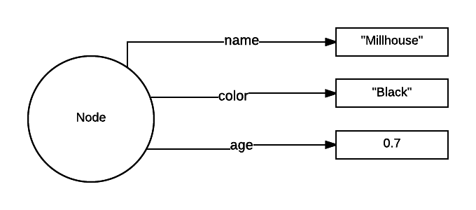
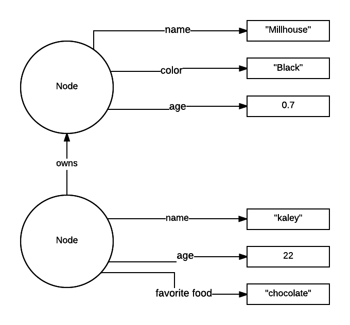

+++
title = "Introduction to Graphs & Dgraph"
+++

## What is a graph?

A graph is comprised of "nodes" and "edges". A node is useless by itself, and
a graph only makes sense when there are a collection of nodes with edges
connecting them.

In dgraph there are two types of "nodes". Literal values and entities.
A node is essentially just something with a unique id that can be
referenced, and a literal value is, for example, a string or number.

Let's represent my pet cat using a graph. The cat would be a node,
and it would have edges, connecting to values, that describe it. My cat's name
is Millhouse, so it would have an edge called "name" that points to a value
"Millhouse". He is black, so we would add another edge called "color" that
points to the value "black". Here's an example:



Notice that the node doesn't have any properties itself. All information
must be represented using the edges. This is in contrast to relational
databases, where the "edges" (foreign relations)
have to be created on top of the data, rather than existing implicitly.
In Dgraph, creating relationships
is the only way to describe and model your data.

So far we have only created edges between nodes and values. Let's create an
edge between the cat and his owner.



Now there are two nodes. Both have edges that point to values, giving the nodes
properties. In terms of a relational database this is roughly equivalent to a
row in table "human" having a column with the primary key of a row in table
"cat".

In our graph there is now a link between
the two nodes, which says that the node with name "Kaley" owns the node with
name "Millhouse".

## Adding data to Dgraph

Now let's do this in Dgraph! If you haven't followed the getting started
guide, do so now: https://docs.dgraph.io/v0.7.4/get-started

Note that you must be using version 0.7.4 or later for the examples
in this guide to work.

Once you have Dgraph setup and running, navigate to http://localhost:8080/

The query below adds both Millhouse and Kaley to the database:

```
mutation {
  set {
   _:cat <name> "Millhouse" .
   _:cat <color> "Black" .
   _:cat <age> "0.7"^^<xs:float> .

   _:human <name> "Kaley" .
   _:human <age> "22"^^<xs:float> .
   _:human <favorite_food> "chocolate" .

   _:human <owns> _:cat .
  }

  schema {
   name: string @index .
  }
}
```

Let's go through this line by line.
`mutation` means that this block will change data or the schema.
`set` means that we want to insert data.

`_:cat <name> "Millhouse" .` is the next line. This creates a node and adds
an edge to that node. `_:cat` is the name of the node inside this query.
During execution it's replaced by an automatically generated, unique id.
`<name>` is what we are calling this edge.  All edges with the same identifier
must be of the same type in Dgraph. `"Millhouse"` is the value we want to point
to. Finally, the line is terminated with a `.`.  In SQL
this is roughly equivalent to a semicolon.

The next line does the same thing, but instead of a name it adds a color.
Since it also uses `_:cat` it will use the node that was just created.

The next line is a little different.  Up until now everything has been a string,
but for age we want to represent it using a number (in years). To insert a float
we use `"0.7"^^<xs:float>`. The way Dgraph models data is based on the RDF
specification, and it uses the same type system.  You can read more
about types in Dgraph here: https://docs.dgraph.io/v0.7.4/query-language/#rdf-type

Next we do the same thing for the human, "Kaley", automatically creating a new
node and adding a name, age, and favourite food.

The last line creates the relationship between the two nodes.  It's
pretty much the same as the other lines.
`_:human` references the node we created in the lines just before. `<owns>`
gives this edge a name. And instead of a value, we point to another node using
`_:cat`.

Don't worry too much about the second block in the mutation. All it does
is index all of the edges that are called "name" so that we can
search through them later.


## Querying: Getting data out

Dgraph uses a language called Graphql+-. The description from
the creators of the language is:
"A GraphQL query is a string interpreted by a server that returns data in a
specified format". In other words, the data you get back looks exactly like the
query you give.  Let's have a look at an example:

```
{
  cats(func:anyofterms(name, "Millhouse")) {
    name
    age
    color
  }
}
```

This will return:


```json
{
  "cats": [
    {
      "age": 0.7,
      "color": "Black",
      "name": "Millhouse"
    }
  ]
}
```

This returns a list of all cats with the name Millhouse. More accurately,
it returns all nodes that return true for the function
`anyofterms(name, "Millhouse")`. That function returns true if a node
has an edge called "name", and that has any of the terms "Millhouse".
Based on the data we added before, this will return one node.

It then walks down the edges that are
called "name", "age", and "color", returning the values that they point to.
Note how the response has the same shape as the query.
This was the main design motivation behind Graphql; you will always know
what the result will look like based on the query.


Now to pull in the relation between the human and the cat:

```
{
  human(func:allofterms(name, "Kaley")) {
    name
    age
    favourite_food

    owns {
      name
      color
      age
    }
  }
}
```

This will return:

```json
{
  "human": [
    {
      "age": 22,
      "name": "Kaley",
      "owns": [
        {
          "age": 0.7,
          "color": "Black",
          "name": "Millhouse"
        }
      ]
    }
  ]
}
```

This query does the same thing as before, except starting with the human,
finding a node with the name "Kaley". The interesting part here, which is the
real power of dgraph, is querying the relationship between two nodes in a simple
and expressive way.

We pull out the edge called "owns", which, based on the data we added before,
points to the cat. We then need to specify the fields we want from the cat node.

Hopefully this guide has helped you get the gist of dgraph.  If you've found
an error in this guide or you've thought of an improvement, please
either post an issue on github, post on slack, or our discourse.

## Further Reading

* https://docs.dgraph.io/v0.7.4/query-language/
* https://www.w3.org/TR/rdf11-concepts/
* https://en.wikipedia.org/wiki/Graph_database
